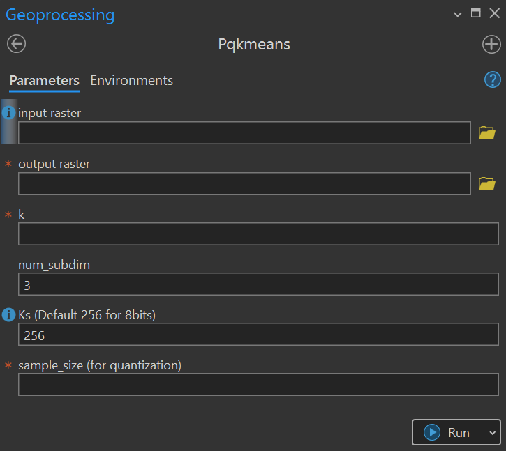

# pqkmeans-arctoolbox

## Setup arcgis pro conda environment:
In ArcGIS Pro, go to `Project > Python > Manage Environments` and select the default conda environment (arcgispro-py3). Click the box clone and name the new environment as you wish.
 
ArcGIS provides a command prompt called **Python Command Prompt (search from windows search bar) that gives access to its conda environment (conda env list to see them and `conda activate <name_of_env>` to activate an environment).
**Note**: You can’t modify the original conda environment, only its clones. You can conda or pip install additional libraries but some of them such as pqkmeans will not show up if you try to list them from arcGIS pro.
 
### Dependencies:
ENV: `ArcGIS Pro 3.3 with python 3.11`  
- Rasterio  
- pqkmeans  

**Note:** Microsoft Build tools (2015) or Visual Studio Comunity 2022 is also required to compile pqkmeans.

pip -r install requirements.txt
 
## Using the tool:
 
After cloning the repository, in arcgis pro go to `insert > toolbox > Add Toolbox` and add the toolbox.

You can start using the tool by opening the tool pqkmeans inside the toolbox and setting the parameters:

- **Input_raster:** A D dimensional image of tif format.

- **output_raster:** A 1D dimensional image of tif format.

- **k:** as you wish for the number of clusters

- **num_of_subdim (M):**  The  number of subdimensions (from the input nD image) for quantization. The higher the subdimension the slower the algorithm.

- **Ks:**  represents the maximum digital number. By default it is 256 that corresponds to 8 bits.

- **sample_size:** The number of pixels you select for quantization. (Good results where achieved with 9.5% of the total number of pixels (Ngolo and Watanabe, 2022)).

Click `Run` to run the tool. You can see the messages of the tool in `Geoprocessing > View Details`.
<kbd>  </kbd>

### References:

Matsui, Y., K. Ogaki, T. Yamasaki, and K. Aizawa 2017.“PQk-means: Billion-scale Clustering for Product-quantized Codes.” Paper presented at the proceedings of the ACM International Conference on Multimedia, Mountain View, California, USA, 23–27 October 1725-1733. https://arxiv.org/abs/1709.03708v1
 
Ngolo, A.M.E and T. Watanabe 2022. “Integrating geographical information systems, remote sensing, and machine learning techniques to monitor urban expansion: an application to Luanda, Angola.” Geo-spatial Information
Science 26 (3): 446-464. https://doi.org/10.1080/10095020.2022.2066574.

### CITATION

# Licence
The source code is licensed under MIT License.
